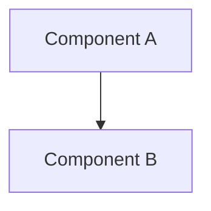

# Developer Onboarding Tutorial - Slide Structure

This directory contains the Rucio WebUI Developer Onboarding Tutorial presentation, organized into individual slide files for better maintainability and readability.

## 📁 Directory Structure

```
developer-onboarding/
├── README.md                      # This file
│
├── 01-title.md                    # Title slide (not needed - defined in slides.md)
├── 02-overview.md                 # Tutorial overview
├── 03-architecture-diagram.md     # Architecture diagram (mermaid)
├── 04-architecture-principles.md  # Key principles
│
├── 11-step1-1-port.md            # Step 1.1: Define port
├── 12-step1-2-dto.md             # Step 1.2: Define DTOs
├── 13-step1-3-gateway.md         # Step 1.3: Implement gateway
├── 14-step1-3-gateway-keypoints.md # Step 1.3: Key points
├── 15-step1-4-endpoint.md        # Step 1.4: Create endpoint
├── 16-step1-5-utils.md           # Step 1.5: Gateway utils
├── 17-step1-6-tests.md           # Step 1.6: Write tests
│
├── 21-step2-1-models.md          # Step 2.1: UseCase models
├── 22-step2-2-ports.md           # Step 2.2: Input/Output ports
├── 23-step2-3-usecase.md         # Step 2.3: Create UseCase
├── 24-step2-4-controller.md      # Step 2.4: Create controller
├── 25-step2-5-presenter.md       # Step 2.5: Create presenter
├── 26-step2-6-viewmodel.md       # Step 2.6: Create view model
├── 27-step2-7-ioc.md             # Step 2.7: IoC registration
│
├── 31-step3-1-api-route.md       # Step 3.1: Create API route
├── 32-step3-2-react-component.md # Step 3.2: React component
├── 33-step3-3-table.md           # Step 3.3: Table component
│
├── 40-part4-design.md            # Part 4: Design patterns
│
├── 80-file-checklist.md          # Quick reference checklist
├── 81-key-concepts.md            # Key concepts summary
├── 82-common-pitfalls.md         # Common pitfalls
│
├── 90-summary.md                 # Tutorial summary
└── 91-resources.md               # Additional resources
```

## 🎯 Slide Numbering Convention

- **01-09**: Introduction (title and overview)
- **10-19**: Part 1 - Gateway layer
- **20-29**: Part 2 - Feature layer (UseCase, Controller, Presenter)
- **30-39**: Part 3 - API routes and UI components
- **40-49**: Part 4 - Design and patterns
- **80-89**: Reference materials
- **90-99**: Summary and resources

This numbering allows for easy insertion of new slides between existing ones.

## 🚀 Usage with Slidev

The presentation uses [Slidev](https://sli.dev/) for rendering slides.

### Starting the Presentation

```bash
# From project root
pnpm install
pnpm dev

# Visit http://localhost:3030
```

### How It Works

The main `slides.md` file (in the project root) references these individual slides using Slidev's `src:` syntax:

```markdown
---
src: ./pages/developer-onboarding/02-overview.md
---
```

Each slide is imported as a separate slide in the presentation.

### Editing Slides

Each slide is a separate markdown file. To edit:

1. Open the specific slide file (e.g., `11-step1-1-port.md`)
2. Make your changes
3. Slidev will hot-reload automatically if running in dev mode

### Adding New Slides

1. Create a new `.md` file with appropriate numbering
2. Add the content following the existing slide patterns
3. Reference it in `/slides.md` at the desired position:
   ```markdown
   ---
   src: ./pages/developer-onboarding/XX-new-slide.md
   ---
   ```

### Reordering Slides

Simply reorder the `src:` references in `/slides.md`.

## 📝 Notes

- **Mermaid Diagrams**: The architecture diagram uses mermaid syntax for better visualization
- **Code Blocks**: Use standard markdown code fences with language specifiers
- **Layouts**: Main slides.md uses Slidev layouts (`layout: center`, `layout: end`)
- **Transitions**: Configured in the main slides.md frontmatter

## 🔧 Features

### Mermaid Support

Slidev has built-in support for Mermaid diagrams:



### Code Highlighting

Uses Shiki for syntax highlighting with line numbers support.

### Presenter Notes

Add presenter notes in slides:

```markdown
---

Some content

<!-- This is a presenter note -->
```

## 📖 Tutorial Content

This tutorial teaches developers how to build features in Rucio WebUI using Clean Architecture:

1. **Part 1**: Secondary Output Port & Gateway (8 min)
2. **Part 2**: Create a Feature (8 min)
3. **Part 3**: Call Feature from a Page (6 min)
4. **Part 4**: Design the Page (3 min)

Total duration: ~30 minutes

## 🎨 Customization

To customize the presentation:

1. **Theme**: Edit the `theme:` property in `/slides.md` frontmatter
2. **Colors**: Add custom CSS in `/slides.md` or use Slidev themes
3. **Layouts**: Use built-in Slidev layouts or create custom ones

See [Slidev documentation](https://sli.dev/) for more customization options.

## 🤝 Contributing

When adding or modifying slides:
- Keep slides focused (one concept per slide)
- Use consistent formatting
- Add key points sections where appropriate
- Test with `pnpm dev` to ensure proper rendering
- Update this README if adding new sections

## 🔗 Resources

- [Slidev Documentation](https://sli.dev/)
- [Mermaid Documentation](https://mermaid.js.org/)
- [Markdown Guide](https://www.markdownguide.org/)
