## 🏗️ Architecture Overview (3 min)

### Architecture Flow

```mermaid {theme: 'base', scale: 0.75}
flowchart LR
    UI[🎨 UI Layer] --> API[🔌 API Layer]
    API --> CTRL[⚙️ Controller]
    CTRL --> UC[💼 UseCase]
    UC --> GW[🚪 Gateway]
    GW --> EP[📡 Endpoint]
    EP --> SRV[🖥️ Rucio Server]

    style UI fill:#e1f5ff
    style API fill:#e1f5ff
    style CTRL fill:#fff4e1
    style UC fill:#e8f5e9
    style GW fill:#fff4e1
    style EP fill:#fff4e1
    style SRV fill:#ffe1e1
```

| Layer | Components | Purpose |
|-------|------------|---------|
| **UI** | React Components | User Interface |
| **API** | Next.js Routes | HTTP Endpoints |
| **Infrastructure** | Controller, Gateway, Endpoint | HTTP → Domain mapping |
| **Core** | UseCase | Business Logic |

